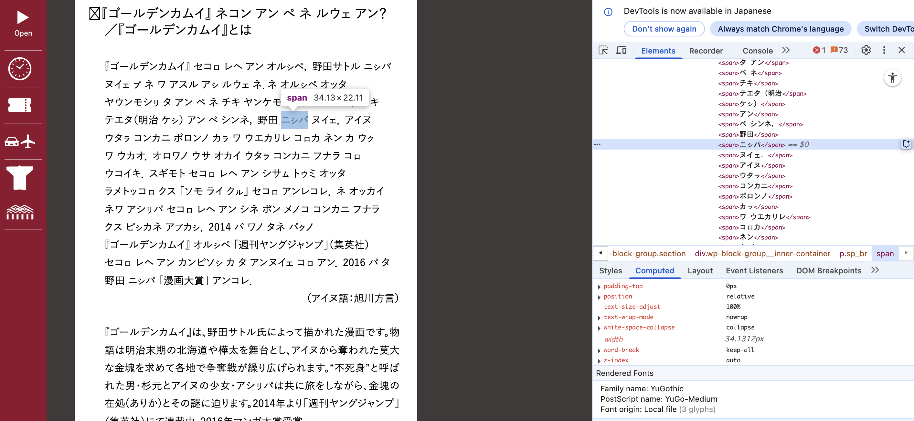
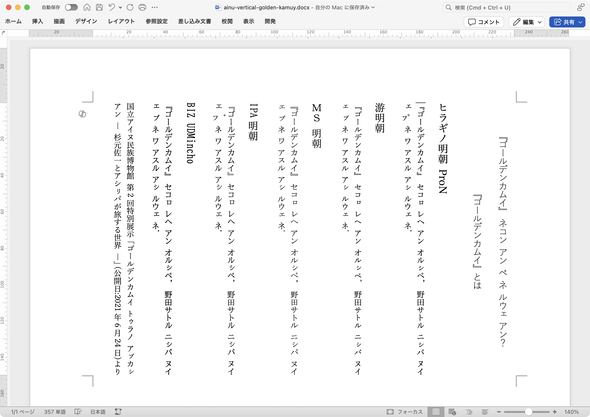
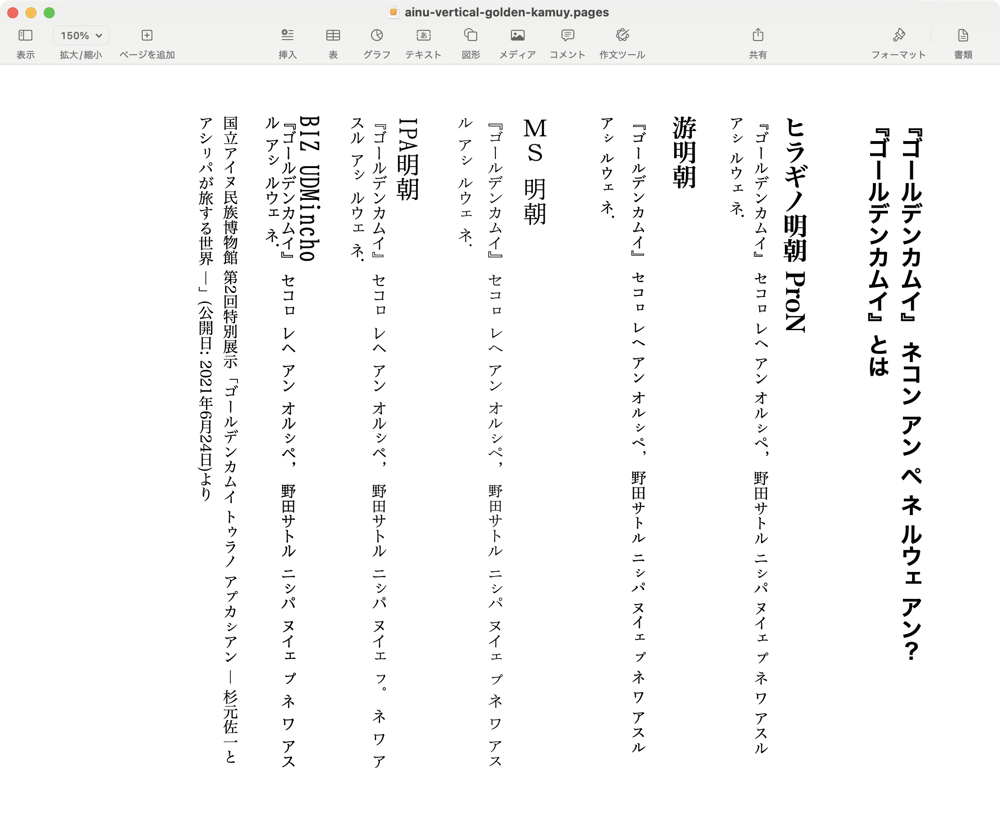
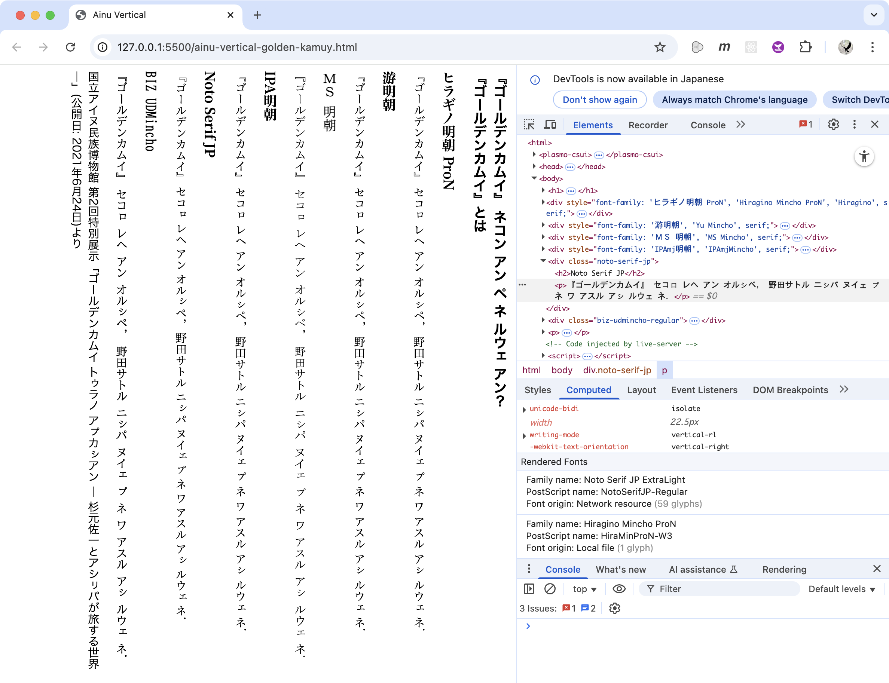
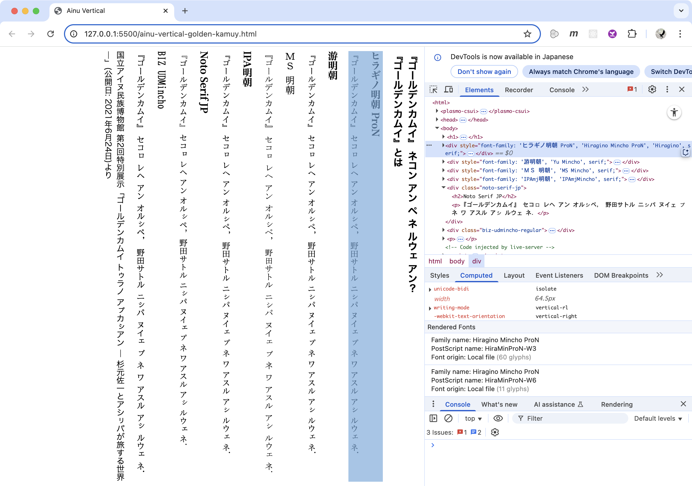
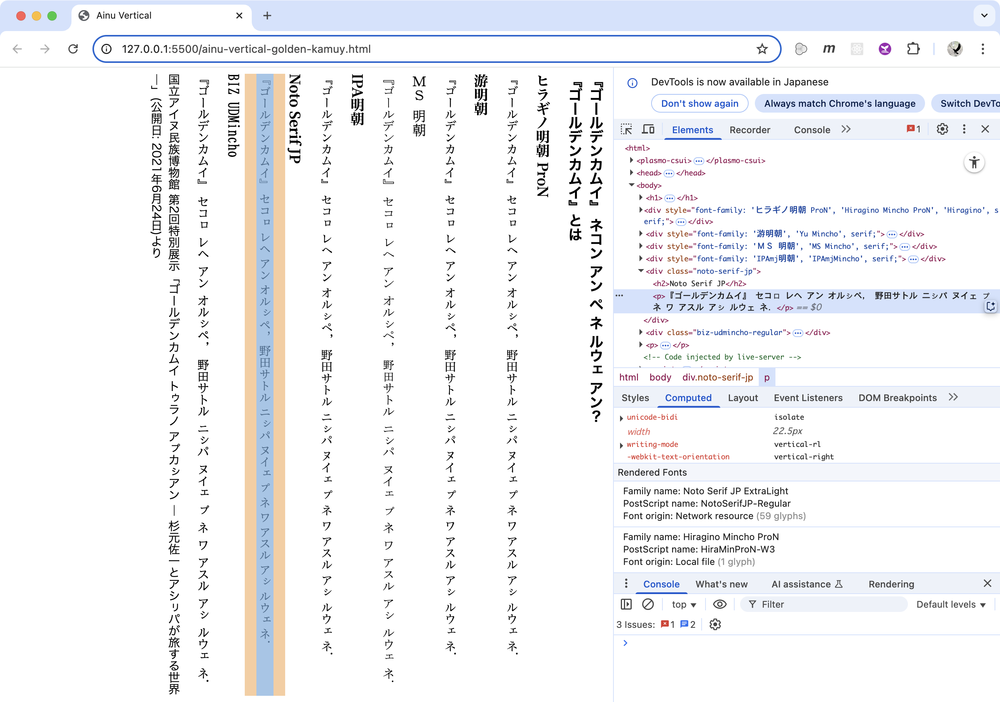
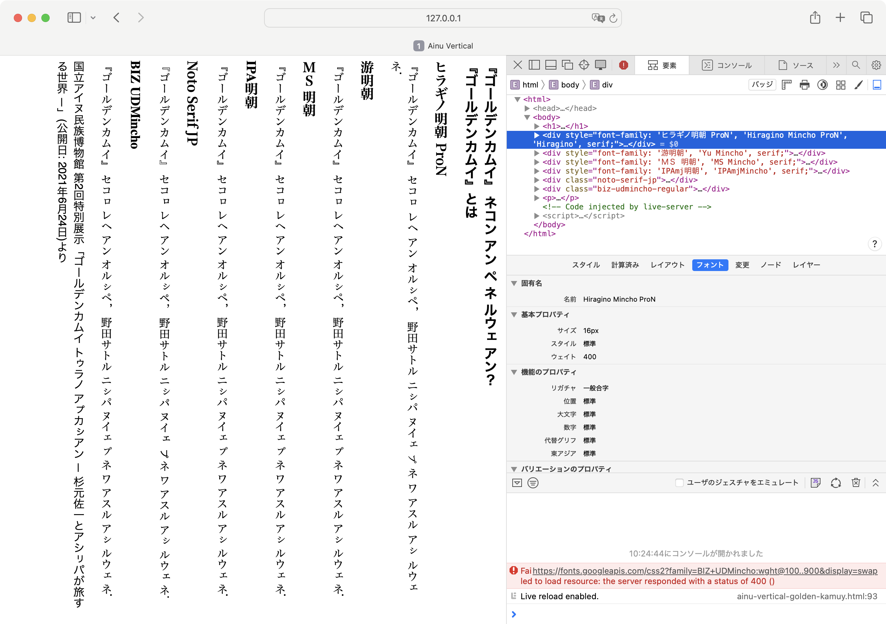
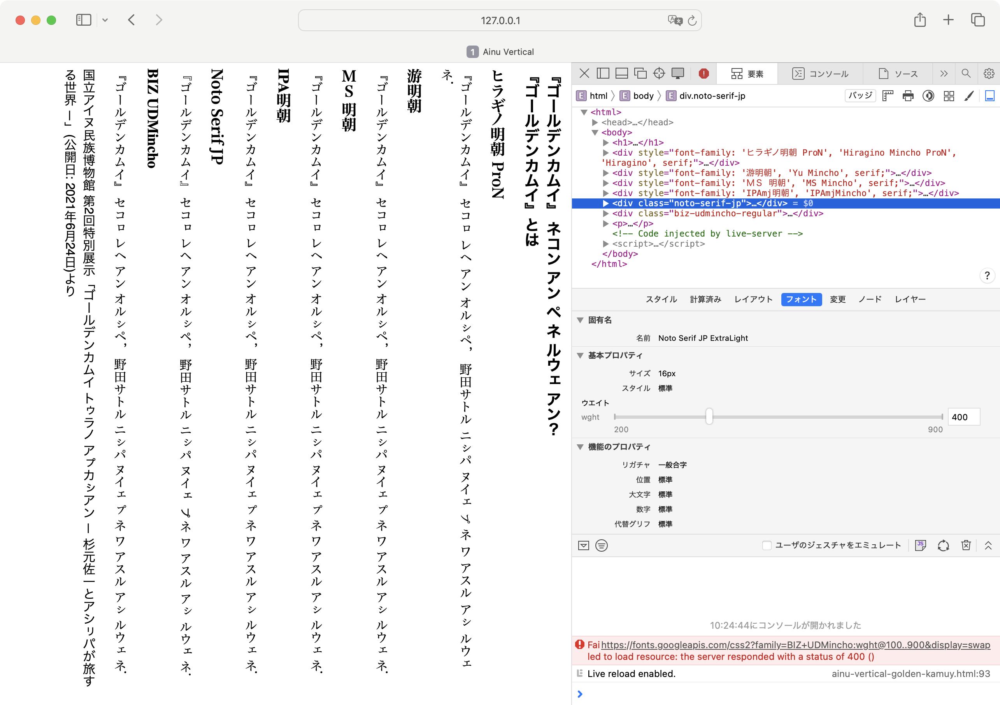

# アイヌ語のカタカナ

みなさま、
ウポポイ[^upopoy]に行ったのですが、国立アイヌ民族博物館[^nam]の研究者の方とお話する機会があって「アイヌ語をカタカナで表記するときの困りごと」をうかがいました。まずはシェアします。

[^upopoy]: ウポポイ（民族共生象徴空間） https://ainu-upopoy.jp/
[^nam]: 国立アイヌ民族博物館  https://nam.go.jp/


以下、引用は山口が要約したものです。

## 縦書きがおかしい

縦書きにしたときに、小書きの仮名がおかしい。例えば、日本語縦書きのポスターの中にアイヌ語を入れるとおかしい、とても苦労しているとのことで、山口も試してみました。

これは、スクリーンショットを交えて長くなるので、次のコメントにします。

## 分かち書き

アイヌ語は分かち書き。分かたれた単位をなんと呼ぶのか、山口は分からないので、以下で**単位**と呼びます。

### 単位の分割

分かち書きされた単位の途中で改行されてしまうと、1つの単位が分かれたのか、2つの単位なのか分からない。途中で分かれると意味が変わる。例えば「アイヌ」の途中で改行されてしまうと、「アイヌ」なのか「ア　イヌ」なのか分かりません:

> …アイヌ  

↓  

> …ア  
> イヌ…  

2つの単位と受け取られた結果、酷い意味になることもあって、この問題は重大とのこと。

そこで、単位が分かれてしまってないか、校正が大変。テキストを一部でも直すと改行位置が変わってしまい、再び全行を確認することになるとのことです。

### 対策で苦労した例

例えば、「ゴールデンカムイ」[^golden-kamuy]とコラボしたときのホームページ。ブラウザーはウィンドウサイズを自由に変えられるが、そうすると改行位置が変わる。単位の途中で改行しないように工夫したとのこと。

[^golden-kamuy]: ゴールデンカムイ  https://youngjump.jp/goldenkamuy/

苦労の内容を調べてみました:



- 途中で切れてはいけない単位を検出して`span`要素で囲むJavaScriptプログラムを書いてるようです
- その`span`要素に次のCSSを設定しています:
    - `word-break: keep-all;`と設定して、CJKテキストの改行を禁止
    - `white-space: nowrap;`と設定して、行をまたがって折り返さない

### 分割を許して、分割されたことを示す方法

分割を許すとすると、英語のハイフネーションのような仕組みを導入するのかもしれない。その記号は`-`がいいという意見や、`=`がいいという意見がある。

ただし、そのような仕組みを導入しようとしたとき、ハイフネーションアルゴリズムは、かなり複雑になりそうとのこと。

### 区切り文字とHTML/CSSのwhite-space

分かち書きの区切りで使うべき文字は、全角スペースなのか、半角スペースなのかについては、分からないとのことでした。

Macのアイヌ語入力ソース[^mac-ainu-input]で山口が試したところでは、スペース・キーで全角スペースが入力されます。

[^mac-ainu-input]: Macでアイヌ語入力ソースを設定する/切り替える  https://support.apple.com/ja-jp/guide/japanese-input-method/jpim10244/mac

アイヌ語の分かち書きのスペースは、HTML/CSSのホワイトスペース(whitespace)と扱われるのか？扱われるべきか？気になりました。

### 区切り文字の空白の幅

フォントによってはスペースの幅が狭くて、単位が分かれてるのかどうか判別できなくと困ることがあるそうです。

## 小書きのカタカナの大きさ

「ロ」と小書きの「ㇿ」など差があまりないとき、その文字サイズ手動でを小さくする場合などあるそうです。

## PDFからコピー＆ペーストすると文字化け

小書きの仮名をPDFからコピー&ペーストすると文字化けする場合があるそうです。山口が試したときも文字化けしました。

例えば、このページのPDFをダウンロードして、Macのプレビューで表示して「イランカラㇷ゚テ」をコピー＆ペーストすると「イランカラ㽸テ」に化けます。


# 縦書きがおかしい

縦書きがおかしい件、実例をあげます。
中身のテキストは次の通り:

[ainu-vertical.txt](./ainu-vertical.txt)
```
『ゴールデンカムイ』 ネコン アン ペ ネ ルウェ アン？
『ゴールデンカムイ』とは
ヒラギノ明朝 ProN
『ゴールデンカムイ』 セコㇿ レヘ アン オルㇱペ， 野田サトル ニㇱパ ヌイェ ㇷ゚ ネ ワ アスル アㇱ ルウェ ネ．
游明朝
『ゴールデンカムイ』 セコㇿ レヘ アン オルㇱペ， 野田サトル ニㇱパ ヌイェ ㇷ゚ ネ ワ アスル アㇱ ルウェ ネ．
ＭＳ 明朝
『ゴールデンカムイ』 セコㇿ レヘ アン オルㇱペ， 野田サトル ニㇱパ ヌイェ ㇷ゚ ネ ワ アスル アㇱ ルウェ ネ．
IPA明朝
『ゴールデンカムイ』 セコㇿ レヘ アン オルㇱペ， 野田サトル ニㇱパ ヌイェ ㇷ゚ ネ ワ アスル アㇱ ルウェ ネ．
BIZ UDMincho
『ゴールデンカムイ』 セコㇿ レヘ アン オルㇱペ， 野田サトル ニㇱパ ヌイェ ㇷ゚ ネ ワ アスル アㇱ ルウェ ネ．

国立アイヌ民族博物館 第2回特別展示「ゴールデンカムイ トゥラノ アㇷ゚カㇱアン ― 杉元佐一とアシㇼパが旅する世界 ―」(公開日:2021年6月24日)より
```

以下、いずれもMacでの表示のスクリーンショットです。


文字が変、回転は、英語扱い？

Word、Pages、フォントによる

ブラウザー、CSSの指定がかかるとは限らないが、Safariとヒラギノの組み合わせでおかしい。

## ワープロ

### Word

Word


「ㇷ゚」、小書きの「プ」がヒラギノ明朝とIPA明朝でおかしいです。

### Pages

Pages


これは、おかしくない。

## ブラウザー

ブラウザーはCSSで設定しても、そのフォントが当たるとはかぎらず、実際に以下の例ではあたってないフォントがあります。開発ツールで確認できたもの

### Google Chrome

画面右下の「Rendered Fonts」が実際にあたってるフォントのはずです。







### Safari

「ㇷ゚」、小書きの「プ」がヒラギノとNoto Serifで、時計回りに90°回転してしまってます。






----


## 何年も前から困っている

何年も前から困ってた、みんな、あきらめ、どうすれば？

## 別の言語だが外国語ではない

> アイヌ語は日本語とは異なる言語だが、**外国語ではない**

----

## 検索


## 新たに追加された文字に関するテスト項目

これに限らず、今後、新しい文字が追加されたときに確認すべき項目のリストができるのではないか。

## 行政DXとアイヌ語カタカナ表記

娘に「アシㇼパ」と名付けられるか？戸籍に登録できるか？

## 文字を借りてる言語のLReq-d
