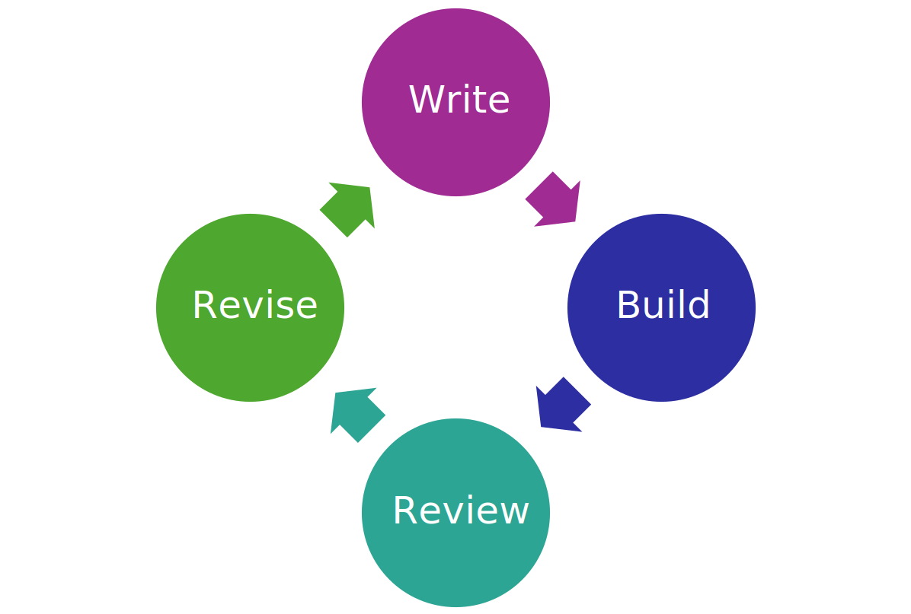
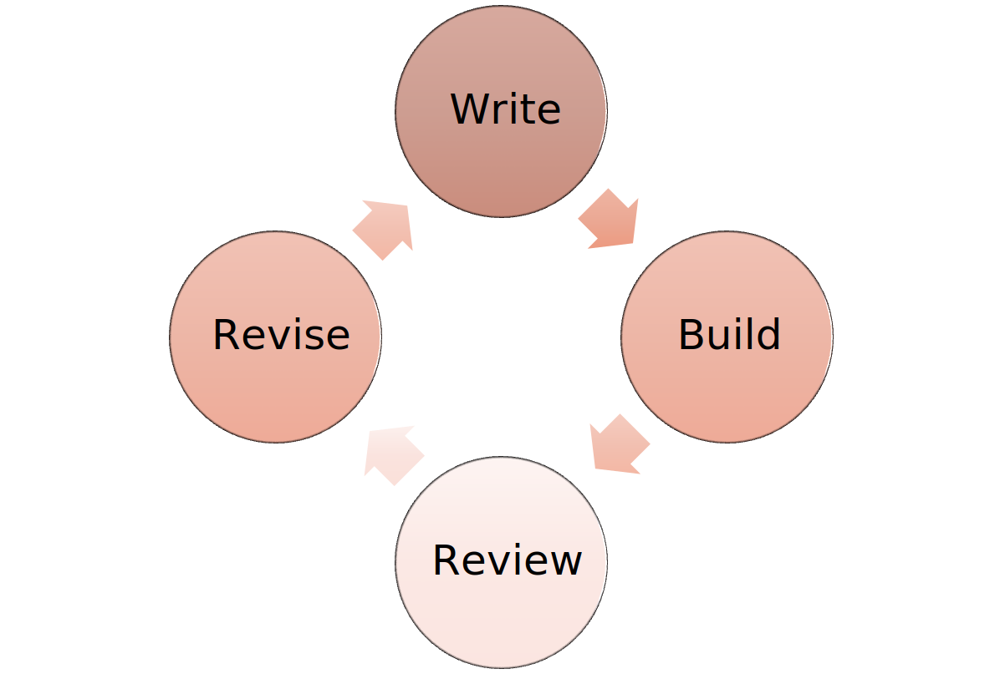

<header>

<!-- sectionを作らせない -->
# Vivliostyleで学会論文を投稿する #

## 著者{.author}

著者 1[](#affi1){.affiref}[](#email-1){.emailref}

著者 2[](#affi2){.affiref}[](#email-2){.emailref}

著者 3[](#affi1){.affiref}[](#paffi3){.paffiref}[](#email-3){.emailref}

## 概要:{.abstract}

Vivliostyleで学会論文を投稿するための、CSSの設定やVFMでの書き方を解説します。
色は匂へど散りぬるを我が世誰ぞ常ならむ、有為の奥山今日越えて浅き夢見し酔ひもせず。
色は匂へど散りぬるを我が世誰ぞ常ならむ、有為の奥山今日越えて浅き夢見し酔ひもせず。

概要の2番目の段落。
色は匂へど散りぬるを我が世誰ぞ常ならむ、有為の奥山今日越えて浅き夢見し酔ひもせず。

## キーワード{.keyword}

Vivliostyle, 論文, VFM, Vivliostyle Flavored Markdown, Markdown, CSS, Cascading Style Sheets
  
## Submitting an Academic Article by Vivliostyle{.title lang="en"} ##

## Author{.author lang="en"}
<!-- 小文字を使っても小さな大文字(small-caps)になります -->

Author's name in small caps[](#affi1){.affiref}[](#email-1){.emailref}

Author 2[](#affi2){.affiref}[](#email-2){.emailref}

Author 3[](#affi1){.affiref}[](#paffi3){.paffiref}[](#email-3){.emailref}

## Abstract:{.abstract lang="en"}

Lorem ipsum dolor sit amet, consectetur adipiscing elit, sed do eiusmod tempor incididunt ut labore et dolore magna aliqua. Ut enim ad minim veniam, quis nostrud exercitation ullamco laboris nisi ut aliquip ex ea commodo consequat. Duis aute irure dolor in reprehenderit in voluptate velit esse cillum dolore eu fugiat nulla pariatur. Excepteur sint occaecat cupidatat non proident, sunt in culpa qui officia deserunt mollit anim id est laborum.

<p lang="en">The 2nd paragraph of the abstract. Hyphenation is invoked by the <code>lang</code> attribute. abstract abstract abstract abstract internationalization abstract abstract abstract abstract abstract abstract abstract abstract abstract abstract abstract abstract abstract abstract abstract abstract abstract abstract abstract abstract.</p>

## Keywords:{.keyword lang="en"}

Vivliostyle, scholarly article, VFM, Vivliostyle Flavored Markdown, Markdown, CSS, Cascading Style Sheets

</header>

## 所属{.affiliate-heading}

<p class="affiliate" id="affi1">所属は左段の下詰めに配置。番号を自動生成。生成した番号を著者の右肩で参照。<br>Affiliate 1</p>

<p class="affiliate" id="affi2">所属2 所属2 所属2 所属2 所属2 所属2 所属2 所属2 所属2<br>Affiliate 2, affiliate 2, affiliate 2, affiliate 2, affiliate 2, affiliate 2, affiliate 2</p>

<p class="paffiliate" id="paffi3"><span lang="ja">前の所属も左段の下詰めに配置。現所属とは別の番号を自動生成。生成した番号を著者の右肩で参照。</span><span lang="en">Affiliate 3</span></p>

## Email{.email-heading}

<p class="email" id="email-1">address-1@example.com</p>

<p class="email" id="email-2">address-2@example.com</p>

<p class="email" id="email-3">address-3@example.com</p>

## はじめに

テキストの量を「色は匂へど散りぬるを我が世誰ぞ常ならむ、有為の奥山今日越えて浅き夢見し酔ひもせず。」で調整しています。

## 段組み{#sec-01}

段組みできます！
本文は2段組、タイトルなどは段抜き。
段組みで本文は左段から順に埋まります。

## 見出し

色は匂へど散りぬるを我が世誰ぞ常ならむ、有為の奥山今日越えて浅き夢見し酔ひもせず。

「色は匂へど散りぬるを我が世誰ぞ常ならむ」、「（約物）」「有為の奥山今日越えて浅き夢見し酔ひもせず。」

### 下のレベルの見出し{#sec-01-01}

「The色は匂へど散りぬるをHTTP我が世誰ぞ常ならむ、internationalization有為のaccessibility奥山（今日越えて）浅き888夢見し酔ひもせず。」

#### 下の下のレベルの見出し

色は匂へど散りぬるを我が世誰ぞ常ならむ、有為の奥山今日越えて浅き夢見し酔ひもせず。

##### Run-inの見出し

このサンプルでは`h5`要素の見出し(Markdownで`#####`で始まる行)をrun-inに設定している。

2つ目の段落。色は匂へど散りぬるを我が世誰ぞ常ならむ、有為の奥山今日越えて浅き夢見し酔ひもせず。

### 段組みで本文を順に埋める

色は匂へど散りぬるを我が世誰ぞ常ならむ、有為の奥山今日越えて浅き夢見し酔ひもせず。

## 図表{#sec-02}

図表は上詰めになってる。ページ上の順番を左上から右下に見るとすると、図表および本文の順番は、ページ上ではソース上とは異なる場合がある。
段内の図表と段抜きの図表の前後関係も、ソース上の順番とは異なる場合がある。
これがおかしいと感じる場合は、ソース上の順番を変えてみる。

### 表

[](#table-01){.tabref}、[](#table-02){.tabref}、[](#table-03){.tabref}がどこかにあるはず。

<figure class="table" id="table-01">
  <figcaption><div lang="ja">Markdownの表。figure要素にidが付いている。Markdownで表を描く場合はtable要素にidを付けられない。キャプションの中で文献を参照できる<a class="cite" href="#ref-06"></a>。</div><div lang="en">Markdown table, caption caption caption caption caption</div></figcaption>

| ラベル | ラベル | ラベル | ラベル |
| :-- | :-- | --: | --: |
| セル | セル | 2 | 10,000 |
| セル | セル | 3 | 1,000 |
| セル | セル | 4 | 100 |
| セル | セル | 10 | 10 |
| セル | セル | 100 | 4 |
| セル | セル | 1000 | 3 |
| セル | セル | 10,000 | 2 |

</figure>

<figure class="table">
  <figcaption><div lang="ja">HTMLの表、table要素にidが付いている。キャプションの中で文献を参照できる<a class="cite" href="#ref-06"></a>。</div><div lang="en">HTML table, caption caption caption caption caption</div></figcaption>
  <table id="table-02" class="col-align-llrr">
  <thead>
  <tr><td></td><th>ラベル</th><th>ラベル</th><th>ラベル</th></tr>
  </thead>
  <tbody>
    <tr><th>セル</th><td>セル</td><td>2</td><td>10,000</td></tr>
    <tr><th>セル</th><td>セル</td><td>3</td><td>1,000</td></tr>
    <tr><th>セル</th><td>セル</td><td>4</td><td>100</td></tr>
    <tr><th>セル</th><td>セル</td><td>10</td><td>10</td></tr>
    <tr><th>セル</th><td>セル</td><td>100</td><td>4</td></tr>
    <tr><th>セル</th><td>セル</td><td>1000</td><td>3</td></tr>
    <tr><th>セル</th><td>セル</td><td>10,000</td><td>2</td></tr>
    </tbody>
  </table>
</figure>

<figure class="table">
  <figcaption><span lang="ja"><a class="tabref" href="#table-02"></a>とは異なる揃えの表。キャプション キャプション キャプション キャプション(idはtable-03)</span><span lang="en">Caption caption caption caption.</span></figcaption>
  <table id="table-03" class="col-align-lrlr">
  <thead>
  <tr><td></td><th>ラベル</th><th>ラベル</th><th>ラベル</th></tr>
  </thead>
  <tbody>
    <tr><th>セル</th><td>2</td><td>セル</td><td>10,000</td></tr>
    <tr><th>セル</th><td>3</td><td>セル</td><td>1,000</td></tr>
    <tr><th>セル</th><td>4</td><td>セル</td><td>100</td></tr>
    <tr><th>セル</th><td>10</td><td>セル</td><td>10</td></tr>
    <tr><th>セル</th><td>100</td><td>セル</td><td>4</td></tr>
    <tr><th>セル</th><td>1,000</td><td>セル</td><td>3</td></tr>
    <tr><th>セル</th><td>10,000</td><td>セル</td><td>2</td></tr>
    </tbody>
  </table>
</figure>

### 図

[](#fig-01){.figref}、[](#fig-02){.figref}、[](#fig-03){.figref}、[](#fig-04){.figref}がどこかにあるはず。

色は匂へど散りぬるを我が世誰ぞ常ならむ、有為の奥山今日越えて浅き夢見し酔ひもせず。

<figure class="fig" id="fig-01">
  
  <figcaption><div>HTMLで挿入した図。図番号を自動生成。日英2つのキャプションを付けて、それぞれのプレフィックスで図番号を付けられる。キャプションの中で文献を参照できる<a class="cite" href="#ref-06"></a></div><div lang="en">Graphic inserted as HTML format.</div></figcaption>
</figure>

{.fig #fig-02}

<figure class="fig col-span-2" id="fig-03">
  
  <figcaption><div>2段にまたがる図。上詰め。キャプションの中で文献を参照できる<a class="cite" href="#ref-06"></a>。</div><div lang="en">Wide firgure spanning two columns.</div></figcaption>
</figure>

{.fig .col-span-2 #fig-04}

### 2つの画像からなる図

2つの画像で1つの図を構成しています。上詰めを止めてあります。

色は匂へど散りぬるを我が世誰ぞ常ならむ、有為の奥山今日越えて浅き夢見し酔ひもせず。

<figure class="fig normal-flow" id="fig-two-img">

{style="width: 40%;"}
{style="width: 40%; margin-inline-start: 1rem;"}
<figcaption><div>2つの画像からなる図</div><div lang="en">Figure consists of two images.</div></figcaption>
</figure>

### 図を横に並べる

図と表を横に並べています。上詰めを止めてあります。

色は匂へど散りぬるを我が世誰ぞ常ならむ、有為の奥山今日越えて浅き夢見し酔ひもせず。
色は匂へど散りぬるを我が世誰ぞ常ならむ、有為の奥山今日越えて浅き夢見し酔ひもせず。
色は匂へど散りぬるを我が世誰ぞ常ならむ、有為の奥山今日越えて浅き夢見し酔ひもせず。

<div class="minipage normal-flow">

{.fig #fig-small style="width: 80%;"}

<figure class="table" id="table-small">
<figcaption><div>小さな表</div><div lang="en">Small table</div></figcaption>

| 品目 | 数量 |
| :--- | ---: |
| パイナップル | 300 |
| ぶどう | 4 |

</figure>
</div>

## 数式

### 番号を付けない数式

数式番号を付けないならMarkdownだけで数式を書ける。

インラインの数式は、例えばこうなります: $E=mc^2$

別行立て数式(別行数式、ディスプレイ数式)はこうなります:

$${\displaystyle G_{\mu \nu }+\Lambda g_{\mu \nu }=\kappa T_{\mu \nu }}$$

### 番号を付ける数式

番号を付ける数式はHTML形式で、数式番号と紐づけた`div`要素で囲む:

<div class="equation number" id="eq-01">

$${\displaystyle G_{\mu \nu }+\Lambda g_{\mu \nu }=\kappa T_{\mu \nu }}$$

</div>

<!-- div要素と数式の間に1行開けない場合、data-math-typeset="true"のspan要素が必要 -->
<div class="equation number" id="eq-02"><span data-math-typeset="true">$${\displaystyle \kappa ={\frac {8\pi G}{c^{4}}}}$$</span></div>

## 章、図表、参考文献、数式の参照

### 章・節番号の参照

[](#sec-01){.secref}の見出しは「段組み」、[](#sec-01-01){.subsecref}の見出しは「下のレベルの見出し」。

### 参考文献の参照

詳細はVivliostyleのホームページを参照[](#ref-01){.cite}、詳しい本も出版されてます[](#ref-02){.cite}。解説記事も連載中！[](#ref-03){.cite}。連続する参照をまとめて[4-6]とする機能はありません[](#ref-04){.cite}[](#ref-05){.cite}[](#ref-06){.cite}。

### 図表の参照

特定の参照、例えば本文中で最初の参照を赤い色にするといった場合は、それに対応したクラスを設定する。ここでは、`first-ref`クラスを手動で設定している。

[](#fig-01){.figref .first-ref}は、色は匂へど散りぬるを我が世誰ぞ常ならむ、有為の奥山今日越えて浅き夢見し酔ひもせず。[](#fig-02){.figref .first-ref}は、いろはにほへと、ちりぬるを、わかよたれそつねならむ、けふのおくやま([](#fig-03){.figref .first-ref}、[](#fig-04){.figref .first-ref})。[](#fig-01){.figref}の2回目の参照。

[](#table-01){.tabref .first-ref}はMarkdownの表。[](#table-02){.tabref .first-ref}はHTMLの表。[](#table-03){.tabref .first-ref}はMarkdownの表。[](#table-01){.tabref}の2回目の参照。

### 数式の参照

数式[](#eq-01){.eqref}はアインシュタイン方程式、[](#eq-02){.eqref}はアインシュタインの重力定数$\kappa$とニュートンの重力定数$G$との関係。、色は匂へど散りぬるを我が世誰ぞ常ならむ、有為の奥山今日越えて浅き夢見し酔ひもせず。

## 脚注

Vivliostyle[](#fn-01){.fn-call}、HTML[](#fn-02){.fn-call}、CSS[](#fn-03){.fn-call}色は匂へど散りぬるを我が世誰ぞ常ならむ、有為の奥山今日越えて浅き夢見し酔ひもせず。

<section class="fn-area">

<span class="fn-text" id="fn-01"><a class="url" href="https://vivliostyle.org/">https://vivliostyle.org/</a></span>

<span class="fn-text" id="fn-02">[Mozilla](https://developer.mozilla.org/ja/){.url}。ここで文献参照もできます[](#ref-01){.cite}。色は匂へど散りぬるを我が世誰ぞ常ならむ、有為の奥山今日越えて浅き夢見し酔ひもせず。</span>

<span class="fn-text" id="fn-03"><https://developer.mozilla.org/ja/>{.url}</span>

</section>

色は匂へど散りぬるを我が世誰ぞ常ならむ、有為の奥山今日越えて浅き夢見し酔ひもせず。色は匂へど散りぬるを我が世誰ぞ常ならむ、有為の奥山今日越えて浅き夢見し酔ひもせず。色は匂へど散りぬるを我が世誰ぞ常ならむ、有為の奥山今日越えて浅き夢見し酔ひもせず。色は匂へど散りぬるを我が世誰ぞ常ならむ、有為の奥山今日越えて浅き夢見し酔ひもせず。

色は匂へど散りぬるを我が世誰ぞ常ならむ、有為の奥山今日越えて浅き夢見し酔ひもせず。色は匂へど散りぬるを我が世誰ぞ常ならむ、有為の奥山今日越えて浅き夢見し酔ひもせず。色は匂へど散りぬるを我が世誰ぞ常ならむ、有為の奥山今日越えて浅き夢見し酔ひもせず。色は匂へど散りぬるを我が世誰ぞ常ならむ、有為の奥山今日越えて浅き夢見し酔ひもせず。

本文[](#fn-04){.fn-call}、本文[](#fn-05){.fn-call}、本文[](#fn-06){.fn-call}。2つ目の脚注エリアに脚注本体を表示する。
<section class="fn-area">
  <span class="fn-text" id="fn-04">2つ目の脚注エリア。4つ目の脚注。</span>
  <span class="fn-text" id="fn-05">5つ目の脚注</span>
  <span class="fn-text" id="fn-06">6つ目の脚注</span>
</section>

## 箇条書き

番号なしの箇条書き。色は匂へど散りぬるを我が世誰ぞ常ならむ、有為の奥山今日越えて浅き夢見し酔ひもせず。

- あああ
- （あああ）あああ（あああ）。「（ああああああああああ）。」
- 「あああ」あああ（あああ）。「ああああああああああ。ああああああああああ。」「ああああああああああ。」「ああああああああああ。ああああああああああ。ああああああああああ。」

番号付き（順序付き）の箇条書き。色は匂へど散りぬるを我が世誰ぞ常ならむ、有為の奥山今日越えて浅き夢見し酔ひもせず。

1. 番号に全角の括弧
1. 「あああ」あああ（あああ）。ああああああああああ。
1. （あああ）あああ（あああ）。「（ああああああああああ）。」
1. あああ
1. 「あああ」あああ（あああ）。「ああああああああああ。ああああああああああ。」「ああああああああああ。」「ああああああああああ。」
1. あああ
1. 「あああ」あああ（あああ）。ああああああああああ。
1. （あああ）あああ（あああ）。「（ああああああああああ）。」
1. あああ
1. 「あああ」あああ（あああ）。ああああああああああ。
1. （あああ）あああ（あああ）。「（ああああああああああ）。」
1. あああ

## 謝辞{.acknowledgement}

ありがとう、この論文はMarkdownで書いてVivliostyleで組みました。Vivliostyleコミュニティに感謝 感謝 感謝 感謝 感謝 感謝 感謝 感謝 感謝 感謝 感謝。

## 参考文献{.reference}

<div class="reference" id="ref-01">Vivliostyle Foundation：Vivliostyle Viewer<br><a class="url" href="https://docs.vivliostyle.org/#/vivliostyle-viewer">https://docs.vivliostyle.org/#/vivliostyle-viewer</a><br>（URLを"⟨"と"⟩"で囲む）</div>
<div class="reference" id="ref-02">リブロワークス, <span class="book-title">Vivliostyle：Web技術で「本」が作れるCSS組版Vivliostyle入門</span><br><a class="url" href="https://www.c-r.com/book/detail/1493">https://www.c-r.com/book/detail/1493</a></div>
<div class="reference" id="ref-03">村上真雄, 他: Vivliostyleが拓くCSS組版の可能性 記事一覧<br><a class="url" href="https://gihyo.jp/list/group/Vivliostyle%E3%81%8C%E6%8B%93%E3%81%8FCSS%E7%B5%84%E7%89%88%E3%81%AE%E5%8F%AF%E8%83%BD%E6%80%A7">https://gihyo.jp/list/group/Vivliostyleが拓くCSS組版の可能性</a></div>
<div class="reference" id="ref-04" lang="en">Author: <span class="book-title">Book Title</span>, Publisher (2024)<br>（英語の文献で書籍の名前をイタリックにする）</div>
<div class="reference" id="ref-05">参考文献は、文献の途中で段別れやページ別れしなように`break-inside: avoid;`を設定してある。</div>
<div class="reference" id="ref-06">「（参考文献5参考文献参考文献参考文献）。」（参考文献参考文献）。「参考文献参考文献参考文献参考文献参考文献参考文献。」</div>
<div class="reference" id="ref-07">参考文献7参考文献参考文献参考文献。参考文献参考文献。参考文献参考文献参考文献参考文献参考文献参考文献。</div>
<div class="reference" id="ref-08">参考文献8参考文献参考文献参考文献。参考文献参考文献。参考文献参考文献参考文献参考文献参考文献参考文献。</div>
<div class="reference" id="ref-09">参考文献9参考文献参考文献参考文献。参考文献参考文献。参考文献参考文献参考文献参考文献参考文献参考文献。</div>
<div class="reference" id="ref-10">参考文献10参考文献参考文献参考文献。参考文献参考文献。参考文献参考文献参考文献参考文献参考文献参考文献。</div>
<div class="reference" id="ref-11">参考文献11参考文献参考文献参考文献。参考文献参考文献。参考文献参考文献参考文献参考文献参考文献参考文献。</div>
<div class="reference" id="ref-12">参考文献12参考文献参考文献参考文献。参考文献参考文献。参考文献参考文献参考文献参考文献参考文献参考文献。</div>

## 付録{.appendix}

「付録」という見出しがアウトラインに表示されるように、「付録」を自動生成にはしない。

「付録」見出しの`h2`要素に`appendix`クラスが設定されていれば、その配下の見出し(`h3`要素など)や図表の番号の前に"A."が付くようにCSSを設定している。こうすることで、テキストや図表を本文に移動するとき、クラスなどの設定を変える必要はない。

### 長い表

長い表がページ分割されたとき、次の段/ページでも見出し行が付く。

<figure class="table" id="table-appendix-01" style="float: none; margin-block-start: 1rem;">
  <figcaption><div lang="ja">長いMarkdownの表。上詰めはやめてある。</div><div lang="en">Long markdown table</div></figcaption>

| ラベル | ラベル | ラベル | ラベル |
| :-- | :-- | --: | --: |
| セル | セル | 1 | 100,000 |
| セル | セル | 2 | 10,000 |
| セル | セル | 3 | 1,000 |
| セル | セル | 4 | 100 |
| セル | セル | 10 | 10 |
| セル | セル | 100 | 4 |
| セル | セル | 1000 | 3 |
| セル | セル | 10,000 | 2 |
| セル | セル | 100,000 | 1 |
| セル | セル | 1 | 100,000 |
| セル | セル | 2 | 10,000 |
| セル | セル | 3 | 1,000 |
| セル | セル | 4 | 100 |
| セル | セル | 10 | 10 |
| セル | セル | 100 | 4 |
| セル | セル | 1000 | 3 |
| セル | セル | 10,000 | 2 |
| セル | セル | 100,000 | 1 |
| セル | セル | 1 | 100,000 |
| セル | セル | 2 | 10,000 |
| セル | セル | 3 | 1,000 |
| セル | セル | 4 | 100 |
| セル | セル | 10 | 10 |
| セル | セル | 100 | 4 |
| セル | セル | 1000 | 3 |
| セル | セル | 10,000 | 2 |
| セル | セル | 100,000 | 1 |
| セル | セル | 1 | 100,000 |
| セル | セル | 2 | 10,000 |
| セル | セル | 3 | 1,000 |
| セル | セル | 4 | 100 |
| セル | セル | 10 | 10 |
| セル | セル | 100 | 4 |
| セル | セル | 1000 | 3 |
| セル | セル | 10,000 | 2 |
| セル | セル | 100,000 | 1 |
| セル | セル | 1 | 100,000 |
| セル | セル | 2 | 10,000 |
| セル | セル | 3 | 1,000 |
| セル | セル | 4 | 100 |
| セル | セル | 10 | 10 |
| セル | セル | 100 | 4 |
| セル | セル | 1000 | 3 |
| セル | セル | 10,000 | 2 |
| セル | セル | 100,000 | 1 |
| セル | セル | 1 | 100,000 |
| セル | セル | 2 | 10,000 |
| セル | セル | 3 | 1,000 |
| セル | セル | 4 | 100 |
| セル | セル | 10 | 10 |
| セル | セル | 100 | 4 |
| セル | セル | 1000 | 3 |
| セル | セル | 10,000 | 2 |
| セル | セル | 100,000 | 1 |
| セル | セル | 1 | 100,000 |
| セル | セル | 2 | 10,000 |
| セル | セル | 3 | 1,000 |
| セル | セル | 4 | 100 |
| セル | セル | 10 | 10 |
| セル | セル | 100 | 4 |
| セル | セル | 1000 | 3 |
| セル | セル | 10,000 | 2 |
| セル | セル | 100,000 | 1 |
| セル | セル | 1 | 100,000 |
| セル | セル | 2 | 10,000 |
| セル | セル | 3 | 1,000 |
| セル | セル | 4 | 100 |
| セル | セル | 10 | 10 |
| セル | セル | 100 | 4 |
| セル | セル | 1000 | 3 |
| セル | セル | 10,000 | 2 |
| セル | セル | 100,000 | 1 |

</figure>

個別に上詰めをやめるときは、次のように`style`属性を設定すればよい。

```HTML
<figure class="table"
  id="table-appendix-01"
  style="float: none;">
```

### `###`の見出し

色は匂へど散りぬるを我が世誰ぞ常ならむ、有為の奥山今日越えて浅き夢見し酔ひもせず。色は匂へど散りぬるを我が世誰ぞ常ならむ、有為の奥山今日越えて浅き夢見し酔ひもせず。

#### `####`の見出し

色は匂へど散りぬるを我が世誰ぞ常ならむ、有為の奥山今日越えて浅き夢見し酔ひもせず。色は匂へど散りぬるを我が世誰ぞ常ならむ、有為の奥山今日越えて浅き夢見し酔ひもせず。

##### `#####`の見出し

色は匂へど散りぬるを我が世誰ぞ常ならむ、有為の奥山今日越えて浅き夢見し酔ひもせず。色は匂へど散りぬるを我が世誰ぞ常ならむ、有為の奥山今日越えて浅き夢見し酔ひもせず。

###### `######`の見出し

色は匂へど散りぬるを我が世誰ぞ常ならむ、有為の奥山今日越えて浅き夢見し酔ひもせず。色は匂へど散りぬるを我が世誰ぞ常ならむ、有為の奥山今日越えて浅き夢見し酔ひもせず。
